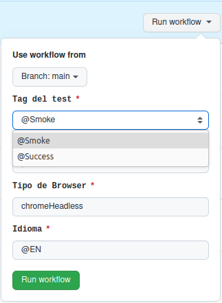
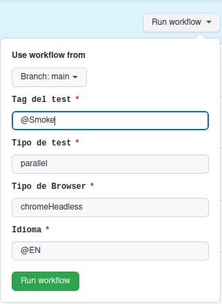
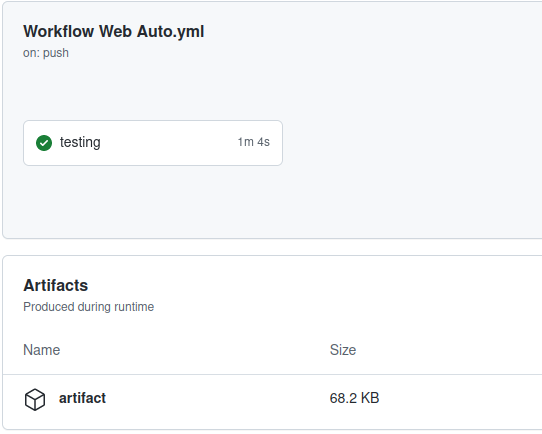

# Pipeline Sample WEB
 Es un proyecto que tiene como finalidad automatizar el testeo del codigo ingresado al repositorio, utilizando el framework Lippia.

## Consideraciones
El proyecto incluye la imagen de Lippia con todas las herramientas necesarias para los tests. En la carpeta .github/workflows se encuentran dos archivos de automatización de pipelines que se ejecutan segun donde se haga el commit o el merge:
- Cuando el commit se realiza a main o master el test se ejecuta automaticamente con el archivo Workflow Web Auto.yml 
- Cuando el commit se realiza a otro branch el test se debe ejecutar manualmente, corriendo el archivo Workflow Web Manual.yml

## Como se usa
* Un nuevo commit en el repositorio dispara el pipeline, iniciando las pruebas pertinentes. En el caso del pipeline manual este debe ser disparado manualmente.
Por defecto el pipeline automatico esta configurado para dispararse cuando se realiza un commit al branch master o main, esto puede ser modificado en el archivo YAML.
algunos ejemplos:

```
on: 
 push:
  branches: [ 'test', 'dev' ] #se modifican las ramas, tambien puede eliminarse una o agregar otra

     #para tener en cuenta
      - '*'         # coincide con cada rama que no contiene un '/'
      - '*/*'       # coincide con cada rama que contiene un solo '/'
      - '**'        # coincide con cada rama
      - '!master'   # excluye la rama master
```

* Este pipeline trabaja con la version de lippia 3.1.2.2, en caso de querer modificarla utilizar una imagen desde el siguiente link

>https://hub.docker.com/r/crowdar/lippia/tags


- Antes de disparar el pipeline se deben configurar las siguientes variables de entorno dentro en los archivos .Workflow Web Auto.yml
y Workflow Web Manual.yml en "jobs: testing: env:", los valores de dichas variables se encuentran en el archivo POM.xml
  * **TAG**: lleva el nombre de la prueba
  * **TESTTYPE**:  determina el tipo de pruebas a realizar
  * **BROWSERTYPE**: determina el perfil de buscador que se usara, para mas informacion ver documentacion lippia 
  * **LANG**: determina el idioma
  
* En el pipeline manual las primeras dos variables despliegan una lista antes de disparar el workflow, puede agregar mas opciones en el YAML, por ejemplo:
  ```
  test_tag:
        description: 'Tag del test'
        required: true
        default: 'warning'
        type: choice
        options:
        - '@Smoke'
        - '@Success'
        - '@regression' #se agrega este test que aparecera en la lista al disparar el pipeline
  ```
  
* Adicionalmente tiene la opcion de cambiar la forma de lista por variables modificables, para ello quite el comentario del bloque correspondiente a la variable y recuerde comentar la version de lista, por ejemplo:
 
```
 ### Este bloque de version lista se comenta ###
  # test_tag:
  #      description: 'Tag del test'
  #      required: true
  #      default: 'warning'
  #      type: choice
  #      options:
  #      - '@Smoke'
  #      - '@Success'
  #      - '@regression'

### Y le sacamos los '#' ala version modificable para activarla ###

 test_tag::
        description: 'Tag del test'
        required: true
        default: '@Smoke'
```


**NOTA:  el pipeline permite modificar o agregar mas variables de entorno dentro del apartado "env"**

* para realizar las pruebas utilizamos el comando: 
```
$ mvn clean test
```
* En caso de agregar o modificar variables de entorno realizar los cambios necesarios en el script del test en los archivos YAML

### Los reportes son generados en una carpeta llamada **Target**, que sera generada una vez que la ejecucion de las pruebas haya finalizado.
* El artifact se encuentra para descargar en actions, dentro del workflow terminado, en la zona inferior de la pagina.


**para mas informacion ver [documentacion lippia.](https://github.com/Crowdar/lippia-web-sample-project#getting-started "documentacion lippia.")**
